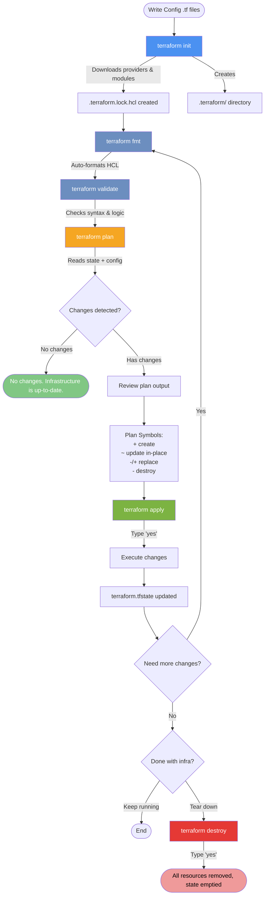

# Terraform Core Workflow

```mermaid
flowchart TD
    Start([Write Config .tf files]) --> Init

    Init["terraform init"]
    Init -->|Downloads providers & modules| LockFile[".terraform.lock.hcl created"]
    Init -->|Creates| DotTF[".terraform/ directory"]
    LockFile --> Fmt

    Fmt["terraform fmt"] -->|Auto-formats HCL| Validate
    Validate["terraform validate"] -->|Checks syntax & logic| Plan

    Plan["terraform plan"]
    Plan -->|Reads state + config| Diff{Changes detected?}

    Diff -->|No changes| UpToDate(["No changes. Infrastructure is up-to-date."])
    Diff -->|Has changes| Review["Review plan output"]

    Review --> Symbols["Plan Symbols:<br>+ create<br>~ update in-place<br>-/+ replace<br>- destroy"]
    Symbols --> Apply

    Apply["terraform apply"]
    Apply -->|Type 'yes'| Execute["Execute changes"]
    Execute --> State["terraform.tfstate updated"]

    State --> Reapply{Need more changes?}
    Reapply -->|Yes| Fmt
    Reapply -->|No| Done{Done with infra?}

    Done -->|Keep running| Stop([End])
    Done -->|Tear down| Destroy

    Destroy["terraform destroy"]
    Destroy -->|Type 'yes'| Removed(["All resources removed, state emptied"])

    style Init fill:#4B91F1,color:#fff
    style Fmt fill:#6C8EBF,color:#fff
    style Validate fill:#6C8EBF,color:#fff
    style Plan fill:#F5A623,color:#fff
    style Apply fill:#7CB342,color:#fff
    style Destroy fill:#E53935,color:#fff
    style UpToDate fill:#81C784,color:#fff
    style Removed fill:#EF9A9A,color:#000
```
