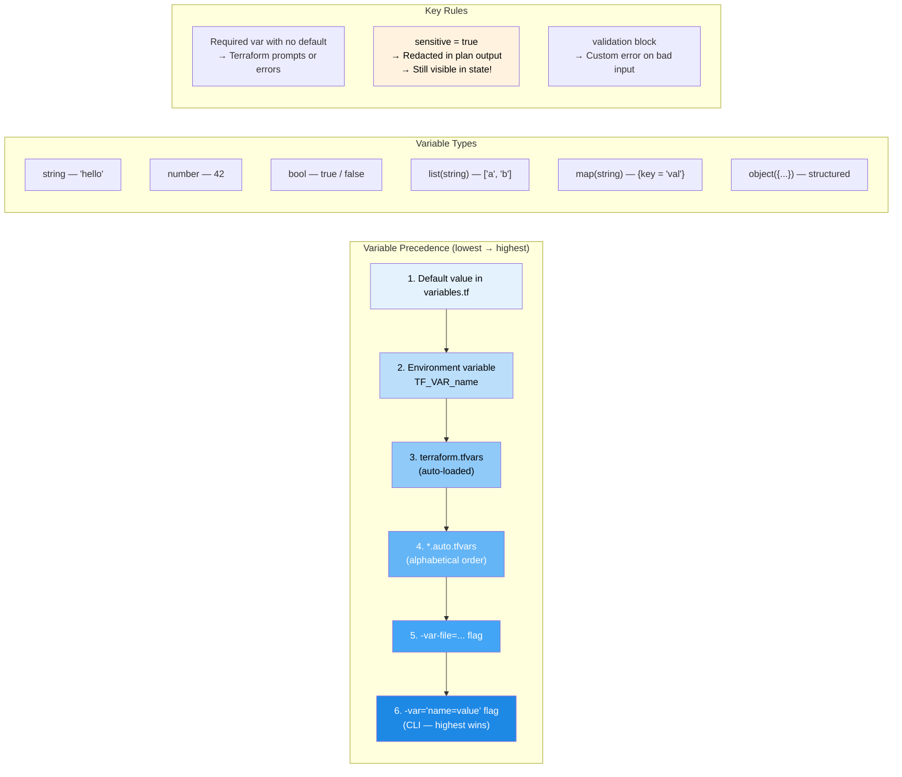

# Terraform Variable Precedence

Lowest to highest — last one wins.

```mermaid
flowchart LR
    subgraph Precedence["Variable Precedence (lowest → highest)"]
        direction TB
        P1["1. Default value in variables.tf"]
        P2["2. Environment variable<br>TF_VAR_name"]
        P3["3. terraform.tfvars<br>(auto-loaded)"]
        P4["4. *.auto.tfvars<br>(alphabetical order)"]
        P5["5. -var-file=... flag"]
        P6["6. -var='name=value' flag<br>(CLI — highest wins)"]

        P1 --> P2 --> P3 --> P4 --> P5 --> P6
    end

    subgraph Types["Variable Types"]
        direction TB
        T1["string — 'hello'"]
        T2["number — 42"]
        T3["bool — true / false"]
        T4["list(string) — ['a', 'b']"]
        T5["map(string) — {key = 'val'}"]
        T6["object({...}) — structured"]
    end

    subgraph Rules["Key Rules"]
        direction TB
        R1["Required var with no default<br>→ Terraform prompts or errors"]
        R2["sensitive = true<br>→ Redacted in plan output<br>→ Still visible in state!"]
        R3["validation block<br>→ Custom error on bad input"]
    end

    style P1 fill:#E3F2FD,color:#000
    style P2 fill:#BBDEFB,color:#000
    style P3 fill:#90CAF9,color:#000
    style P4 fill:#64B5F6,color:#fff
    style P5 fill:#42A5F5,color:#fff
    style P6 fill:#1E88E5,color:#fff
    style R2 fill:#FFF3E0,color:#000
```
