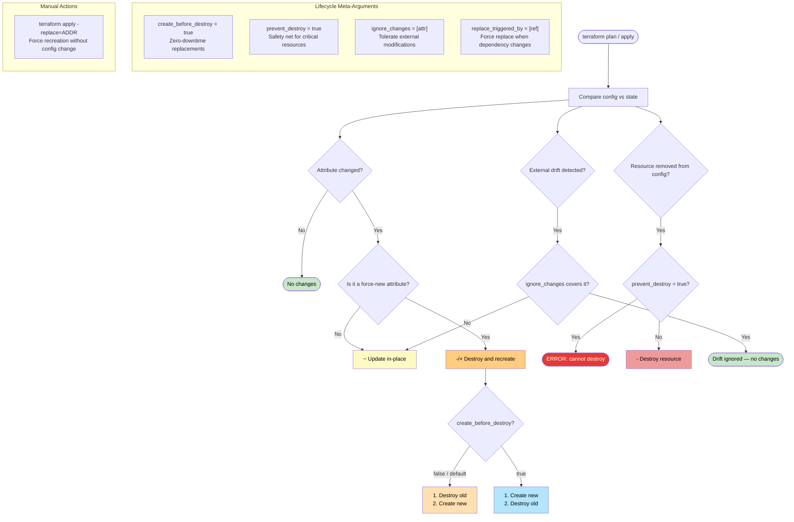

# Resource Lifecycle Decision Tree

How Terraform decides what happens to a resource during `terraform apply`.

```mermaid
flowchart TD
    Start(["terraform plan / apply"]) --> Compare["Compare config vs state"]

    Compare --> Changed{Attribute changed?}
    Changed -->|No| NoOp(["No changes"])

    Changed -->|Yes| ForceNew{Is it a force-new attribute?}

    ForceNew -->|No| InPlace["~ Update in-place"]
    ForceNew -->|Yes| Replace["-/+ Destroy and recreate"]

    Replace --> CBD{create_before_destroy?}
    CBD -->|false / default| DefaultOrder["1. Destroy old<br>2. Create new"]
    CBD -->|true| ReverseOrder["1. Create new<br>2. Destroy old"]

    Compare --> Removed{Resource removed from config?}
    Removed -->|Yes| PreventCheck{prevent_destroy = true?}
    PreventCheck -->|Yes| Error(["ERROR: cannot destroy"])
    PreventCheck -->|No| Destroy["- Destroy resource"]

    Compare --> Drift{External drift detected?}
    Drift -->|Yes| IgnoreCheck{ignore_changes covers it?}
    IgnoreCheck -->|Yes| NoDrift(["Drift ignored — no changes"])
    IgnoreCheck -->|No| InPlace

    subgraph Lifecycle Meta-Arguments
        direction TB
        L1["create_before_destroy = true<br>Zero-downtime replacements"]
        L2["prevent_destroy = true<br>Safety net for critical resources"]
        L3["ignore_changes = [attr]<br>Tolerate external modifications"]
        L4["replace_triggered_by = [ref]<br>Force replace when dependency changes"]
    end

    subgraph Manual Actions
        direction TB
        M1["terraform apply -replace=ADDR<br>Force recreation without config change"]
    end

    style InPlace fill:#FFF9C4,color:#000
    style Replace fill:#FFCC80,color:#000
    style Destroy fill:#EF9A9A,color:#000
    style NoOp fill:#C8E6C9,color:#000
    style NoDrift fill:#C8E6C9,color:#000
    style Error fill:#E53935,color:#fff
    style DefaultOrder fill:#FFE0B2,color:#000
    style ReverseOrder fill:#B3E5FC,color:#000
```
