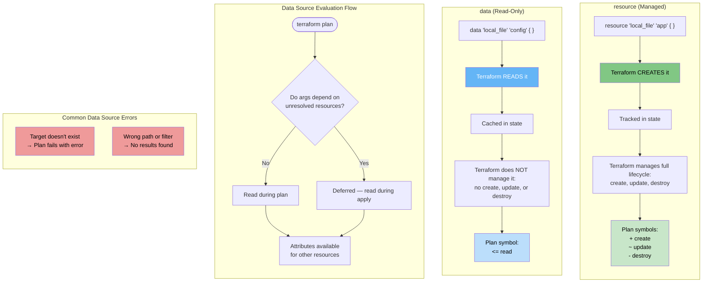

# Data Source vs Resource

How Terraform treats data sources compared to managed resources.

```mermaid
flowchart TD
    subgraph Resource["resource (Managed)"]
        direction TB
        R1["resource 'local_file' 'app' { }"]
        R1 --> R2["Terraform CREATES it"]
        R2 --> R3["Tracked in state"]
        R3 --> R4["Terraform manages full lifecycle:<br>create, update, destroy"]
        R4 --> R5["Plan symbols:<br>+ create<br>~ update<br>- destroy"]
    end

    subgraph DataSource["data (Read-Only)"]
        direction TB
        D1["data 'local_file' 'config' { }"]
        D1 --> D2["Terraform READS it"]
        D2 --> D3["Cached in state"]
        D3 --> D4["Terraform does NOT manage it:<br>no create, update, or destroy"]
        D4 --> D5["Plan symbol:<br><= read"]
    end

    subgraph Flow["Data Source Evaluation Flow"]
        direction TB
        F1(["terraform plan"]) --> F2{"Do args depend on<br>unresolved resources?"}
        F2 -->|No| F3["Read during plan"]
        F2 -->|Yes| F4["Deferred — read during apply"]
        F3 --> F5["Attributes available<br>for other resources"]
        F4 --> F5
    end

    subgraph Errors["Common Data Source Errors"]
        direction TB
        E1["Target doesn't exist<br>→ Plan fails with error"]
        E2["Wrong path or filter<br>→ No results found"]
    end

    style R2 fill:#81C784,color:#000
    style R5 fill:#C8E6C9,color:#000
    style D2 fill:#64B5F6,color:#fff
    style D5 fill:#BBDEFB,color:#000
    style E1 fill:#EF9A9A,color:#000
    style E2 fill:#EF9A9A,color:#000
```
