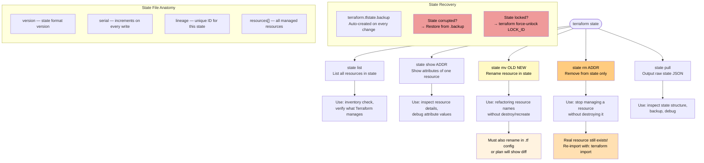

# State Operations Map

When and why to use each `terraform state` command.

```mermaid
flowchart TD
    State(["terraform state"]) --> List
    State --> Show
    State --> Mv
    State --> Rm
    State --> Pull

    List["state list<br>List all resources in state"]
    List --> ListUse["Use: inventory check,<br>verify what Terraform manages"]

    Show["state show ADDR<br>Show attributes of one resource"]
    Show --> ShowUse["Use: inspect resource details,<br>debug attribute values"]

    Mv["state mv OLD NEW<br>Rename resource in state"]
    Mv --> MvUse["Use: refactoring resource names<br>without destroy/recreate"]
    MvUse --> MvWarn["Must also rename in .tf config<br>or plan will show diff"]

    Rm["state rm ADDR<br>Remove from state only"]
    Rm --> RmUse["Use: stop managing a resource<br>without destroying it"]
    RmUse --> RmWarn["Real resource still exists!<br>Re-import with: terraform import"]

    Pull["state pull<br>Output raw state JSON"]
    Pull --> PullUse["Use: inspect state structure,<br>backup, debug"]

    subgraph Recovery["State Recovery"]
        direction TB
        Backup["terraform.tfstate.backup<br>Auto-created on every change"]
        Corrupt["State corrupted?<br>→ Restore from .backup"]
        Lock["State locked?<br>→ terraform force-unlock LOCK_ID"]
    end

    subgraph StateFile["State File Anatomy"]
        direction TB
        S1["version — state format version"]
        S2["serial — increments on every write"]
        S3["lineage — unique ID for this state"]
        S4["resources[] — all managed resources"]
    end

    style Mv fill:#FFF9C4,color:#000
    style Rm fill:#FFCC80,color:#000
    style MvWarn fill:#FFF3E0,color:#000
    style RmWarn fill:#FFE0B2,color:#000
    style Lock fill:#EF9A9A,color:#000
    style Corrupt fill:#EF9A9A,color:#000
```
