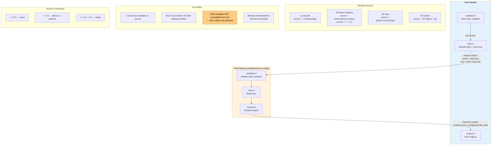

# Module Architecture

How root and child modules communicate through inputs and outputs.

```mermaid
flowchart TD
    subgraph Root["Root Module"]
        direction TB
        RMain["main.tf<br>Module calls + resources"]
        RVars["variables.tf<br>Root input variables"]
        ROut["outputs.tf<br>Root outputs"]
    end

    subgraph Child["Child Module (modules/server-config/)"]
        direction TB
        CMain["main.tf<br>Resources"]
        CVars["variables.tf<br>Module input variables"]
        COut["outputs.tf<br>Module outputs"]
    end

    RVars -->|"var.servers"| RMain
    RMain -->|"Passes inputs:<br>name = each.key<br>role = each.value.role"| CVars
    CVars --> CMain
    CMain --> COut
    COut -->|"Exposes outputs:<br>module.server_config['web'].file_path"| ROut

    subgraph Sources["Module Sources"]
        direction TB
        Local["Local path<br>source = './modules/app'"]
        Registry["Terraform Registry<br>source = 'hashicorp/consul/aws'<br>version = '~> 1.0'"]
        Git["Git repo<br>source = 'github.com/org/repo'"]
        S3["S3 bucket<br>source = 's3::https://...zip'"]
    end

    subgraph Rules["Key Rules"]
        direction TB
        Rule1["Cannot use variables in source"]
        Rule2["Must run terraform init after adding modules"]
        Rule3["Child variables NOT accessible from root<br>— only outputs are exposed"]
        Rule4["Modules downloaded to<br>.terraform/modules/"]
    end

    subgraph Versioning["Version Constraints"]
        direction TB
        V1["= 1.0.0 — exact"]
        V2["~> 1.0 — allows 1.x patches"]
        V3[">= 1.0, < 2.0 — range"]
    end

    style Root fill:#E3F2FD,color:#000
    style Child fill:#FFF3E0,color:#000
    style Rule3 fill:#FFCC80,color:#000
```
