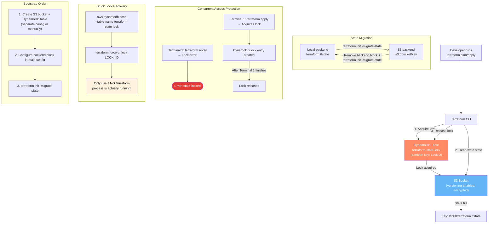

# Remote Backend — S3 + DynamoDB

How Terraform uses S3 for state storage and DynamoDB for locking.

```mermaid
flowchart TD
    Dev["Developer runs<br>terraform plan/apply"] --> TF["Terraform CLI"]

    TF -->|"1. Acquire lock"| Dynamo["DynamoDB Table<br>terraform-state-lock<br>(partition key: LockID)"]
    Dynamo -->|"Lock acquired"| S3

    TF -->|"2. Read/write state"| S3["S3 Bucket<br>(versioning enabled, encrypted)"]
    S3 -->|"State file"| Key["Key: lab08/terraform.tfstate"]

    TF -->|"3. Release lock"| Dynamo

    subgraph Migration["State Migration"]
        direction LR
        Local["Local backend<br>terraform.tfstate"] -->|"terraform init -migrate-state"| Remote["S3 backend<br>s3://bucket/key"]
        Remote -->|"Remove backend block +<br>terraform init -migrate-state"| Local
    end

    subgraph Locking["Concurrent Access Protection"]
        direction TB
        T1["Terminal 1: terraform apply<br>→ Acquires lock"] --> Lock["DynamoDB lock entry created"]
        T2["Terminal 2: terraform apply<br>→ Lock error!"] --> Fail(["Error: state locked"])
        Lock -->|"After Terminal 1 finishes"| Unlock["Lock released"]
    end

    subgraph ForceUnlock["Stuck Lock Recovery"]
        direction TB
        FU1["aws dynamodb scan<br>--table-name terraform-state-lock"]
        FU1 --> FU2["terraform force-unlock LOCK_ID"]
        FU2 --> FU3["Only use if NO Terraform<br>process is actually running!"]
    end

    subgraph Bootstrap["Bootstrap Order"]
        direction TB
        B1["1. Create S3 bucket + DynamoDB table<br>(separate config or manually)"]
        B2["2. Configure backend block in main config"]
        B3["3. terraform init -migrate-state"]
        B1 --> B2 --> B3
    end

    style Dynamo fill:#FF8A65,color:#fff
    style S3 fill:#64B5F6,color:#fff
    style Fail fill:#E53935,color:#fff
    style FU3 fill:#FFF3E0,color:#000
```
