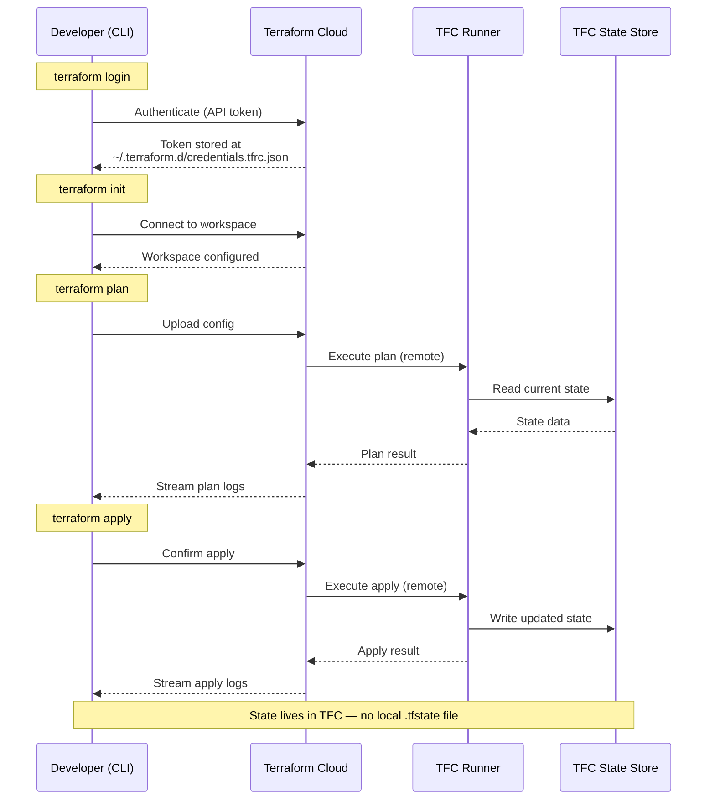
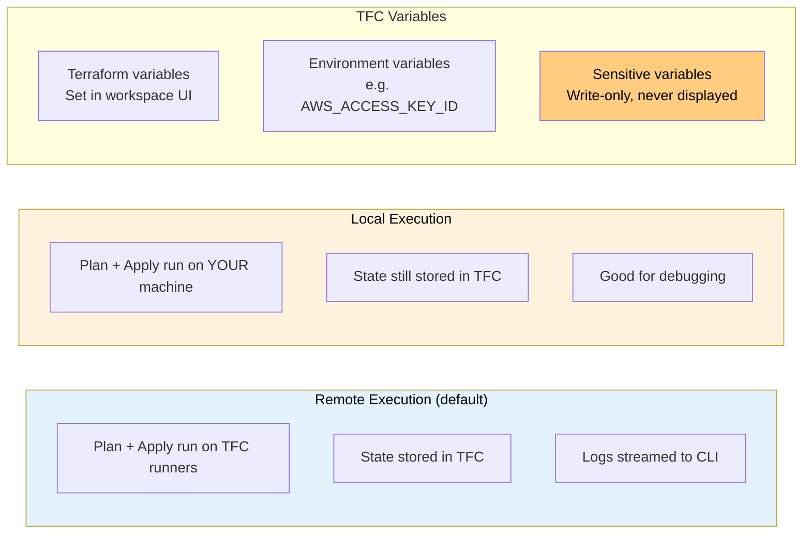

# Terraform Cloud Workflow

How CLI-driven runs flow through Terraform Cloud.

```mermaid
sequenceDiagram
    participant Dev as Developer (CLI)
    participant TFC as Terraform Cloud
    participant Runner as TFC Runner
    participant State as TFC State Store

    Note over Dev: terraform login
    Dev->>TFC: Authenticate (API token)
    TFC-->>Dev: Token stored at<br>~/.terraform.d/credentials.tfrc.json

    Note over Dev: terraform init
    Dev->>TFC: Connect to workspace
    TFC-->>Dev: Workspace configured

    Note over Dev: terraform plan
    Dev->>TFC: Upload config
    TFC->>Runner: Execute plan (remote)
    Runner->>State: Read current state
    State-->>Runner: State data
    Runner-->>TFC: Plan result
    TFC-->>Dev: Stream plan logs

    Note over Dev: terraform apply
    Dev->>TFC: Confirm apply
    TFC->>Runner: Execute apply (remote)
    Runner->>State: Write updated state
    Runner-->>TFC: Apply result
    TFC-->>Dev: Stream apply logs

    Note over Dev,State: State lives in TFC — no local .tfstate file
```

## Execution Modes

```mermaid
flowchart LR
    subgraph RemoteExec["Remote Execution (default)"]
        direction TB
        RE1["Plan + Apply run on TFC runners"]
        RE2["State stored in TFC"]
        RE3["Logs streamed to CLI"]
    end

    subgraph LocalExec["Local Execution"]
        direction TB
        LE1["Plan + Apply run on YOUR machine"]
        LE2["State still stored in TFC"]
        LE3["Good for debugging"]
    end

    subgraph Variables["TFC Variables"]
        direction TB
        TV["Terraform variables<br>Set in workspace UI"]
        EV["Environment variables<br>e.g. AWS_ACCESS_KEY_ID"]
        SV["Sensitive variables<br>Write-only, never displayed"]
    end

    style RemoteExec fill:#E3F2FD,color:#000
    style LocalExec fill:#FFF3E0,color:#000
    style SV fill:#FFCC80,color:#000
```
