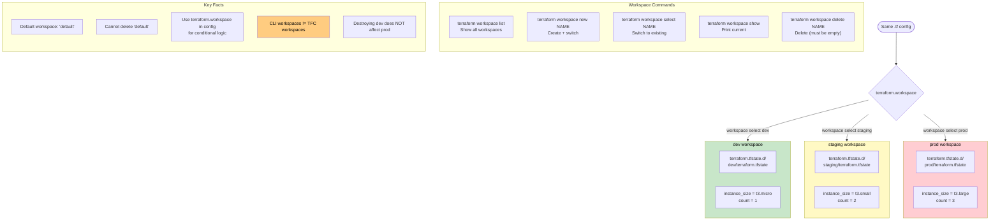

# Workspaces — State Isolation

How CLI workspaces keep environments separated.

```mermaid
flowchart TD
    Config(["Same .tf config"]) --> WS{"terraform.workspace"}

    WS -->|"workspace select dev"| Dev
    WS -->|"workspace select staging"| Staging
    WS -->|"workspace select prod"| Prod

    subgraph Dev["dev workspace"]
        DevState["terraform.tfstate.d/<br>dev/terraform.tfstate"]
        DevRes["instance_size = t3.micro<br>count = 1"]
    end

    subgraph Staging["staging workspace"]
        StagState["terraform.tfstate.d/<br>staging/terraform.tfstate"]
        StagRes["instance_size = t3.small<br>count = 2"]
    end

    subgraph Prod["prod workspace"]
        ProdState["terraform.tfstate.d/<br>prod/terraform.tfstate"]
        ProdRes["instance_size = t3.large<br>count = 3"]
    end

    subgraph Commands["Workspace Commands"]
        direction TB
        C1["terraform workspace list<br>Show all workspaces"]
        C2["terraform workspace new NAME<br>Create + switch"]
        C3["terraform workspace select NAME<br>Switch to existing"]
        C4["terraform workspace show<br>Print current"]
        C5["terraform workspace delete NAME<br>Delete (must be empty)"]
    end

    subgraph KeyFacts["Key Facts"]
        direction TB
        K1["Default workspace: 'default'"]
        K2["Cannot delete 'default'"]
        K3["Use terraform.workspace in config<br>for conditional logic"]
        K4["CLI workspaces != TFC workspaces"]
        K5["Destroying dev does NOT affect prod"]
    end

    style Dev fill:#C8E6C9,color:#000
    style Staging fill:#FFF9C4,color:#000
    style Prod fill:#FFCDD2,color:#000
    style K4 fill:#FFCC80,color:#000
```
