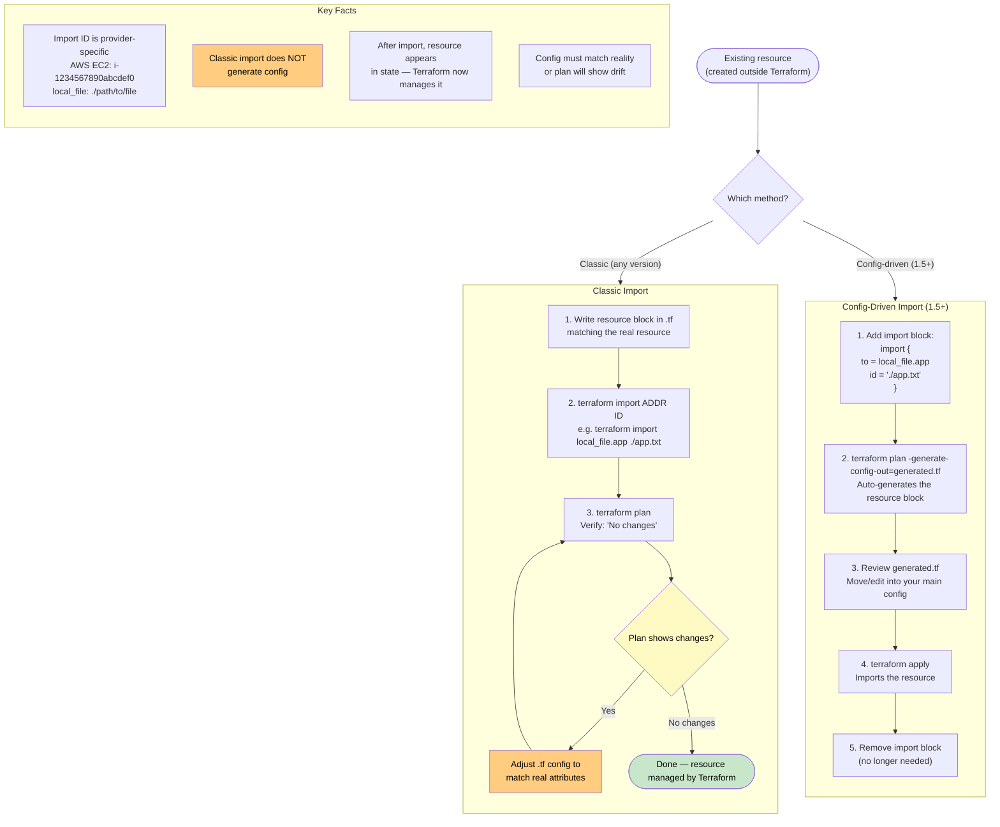

# Terraform Import Workflow

Bring existing resources under Terraform management.

```mermaid
flowchart TD
    Existing(["Existing resource<br>(created outside Terraform)"]) --> Choose{Which method?}

    Choose -->|"Classic (any version)"| Classic
    Choose -->|"Config-driven (1.5+)"| ConfigDriven

    subgraph Classic["Classic Import"]
        direction TB
        CL1["1. Write resource block in .tf<br>matching the real resource"]
        CL2["2. terraform import ADDR ID<br>e.g. terraform import local_file.app ./app.txt"]
        CL3["3. terraform plan<br>Verify: 'No changes'"]
        CL4{"Plan shows changes?"}
        CL5["Adjust .tf config to<br>match real attributes"]
        CL6(["Done — resource managed by Terraform"])

        CL1 --> CL2 --> CL3 --> CL4
        CL4 -->|"Yes"| CL5 --> CL3
        CL4 -->|"No changes"| CL6
    end

    subgraph ConfigDriven["Config-Driven Import (1.5+)"]
        direction TB
        CD1["1. Add import block:<br>import {<br>  to = local_file.app<br>  id = './app.txt'<br>}"]
        CD2["2. terraform plan -generate-config-out=generated.tf<br>Auto-generates the resource block"]
        CD3["3. Review generated.tf<br>Move/edit into your main config"]
        CD4["4. terraform apply<br>Imports the resource"]
        CD5["5. Remove import block<br>(no longer needed)"]

        CD1 --> CD2 --> CD3 --> CD4 --> CD5
    end

    subgraph KeyFacts["Key Facts"]
        direction TB
        F1["Import ID is provider-specific<br>AWS EC2: i-1234567890abcdef0<br>local_file: ./path/to/file"]
        F2["Classic import does NOT<br>generate config"]
        F3["After import, resource appears<br>in state — Terraform now manages it"]
        F4["Config must match reality<br>or plan will show drift"]
    end

    style CL6 fill:#C8E6C9,color:#000
    style CL4 fill:#FFF9C4,color:#000
    style CL5 fill:#FFCC80,color:#000
    style F2 fill:#FFCC80,color:#000
```
